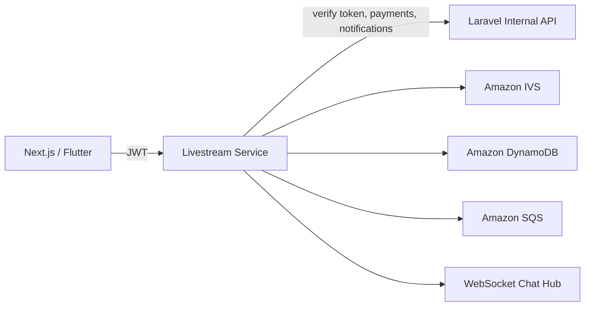

# Livestream Service (Go)

A live streaming microservice for a content monetization platform. This service is designed to run separately from Laravel and handles stream lifecycle, live chat, private sessions, and access/ticket gates.

## Highlights

- Go 1.22+ service with chi router
- WebSocket chat with gorilla/websocket
- Swagger 2.0 docs via swaggo
- AWS integrations:
  - IVS for channel/stream operations
  - DynamoDB for stream/chat/ticket data
  - SQS for async event publishing
- Laravel internal API client for auth and all payment operations
- Structured JSON logs via zerolog
- Graceful HTTP shutdown
- Local-first development support with LocalStack (DynamoDB + SQS)

## Architecture

Notes:

- Money never flows through this service directly.
- Payment charge requests are delegated to Laravel.
- In local mode, IVS can be mocked while DynamoDB/SQS run on LocalStack.

## Project Layout

- cmd/server/main.go: server bootstrap, routes, middleware, graceful shutdown
- internal/config: environment-driven config loading
- internal/db: DynamoDB-backed store with in-memory fallback
- internal/stream: stream lifecycle and IVS abstraction
- internal/session: private 1:1 session flows
- internal/chat: WebSocket chat hub + history
- internal/payment: tipping flow through Laravel
- internal/ticket: paid access + verification
- internal/recording: IVS webhook handling and VOD URL response
- internal/events: SQS event publisher abstraction
- pkg/laravel: typed internal Laravel API client
- pkg/api: shared success/error response envelopes
- docs: generated Swagger artifacts

## Requirements

- Go 1.22 or newer
- Docker + Docker Compose (for local AWS emulation)
- AWS credentials (for real AWS mode)
- Optional: aws CLI (used by local bootstrap script)

## Environment Variables

Copy .env.example to .env and adjust values.

Core:

- PORT: HTTP port (default 8080)
- ENV: environment label, example development

AWS:

- AWS_REGION: AWS region, example us-east-1
- AWS_ACCESS_KEY_ID / AWS_SECRET_ACCESS_KEY
- AWS_ENDPOINT_URL: optional custom endpoint (use http://localhost:4566 for LocalStack)
- USE_MOCK_IVS: true/false, force mock IVS client
- DYNAMODB_TABLE_STREAMS: stream metadata table
- DYNAMODB_TABLE_CHAT: chat messages table
- DYNAMODB_TABLE_TICKETS: tickets table
- SQS_QUEUE_URL: queue URL for async events
- SQS_QUEUE_NAME: local bootstrap helper queue name (default livestream-events)

Recording/CDN:

- IVS_WEBHOOK_SECRET
- S3_BUCKET_RECORDINGS
- CLOUDFRONT_DOMAIN
- CLOUDFRONT_KEY_PAIR_ID
- CLOUDFRONT_PRIVATE_KEY_PATH

Laravel internal API:

- LARAVEL_INTERNAL_URL
- LARAVEL_INTERNAL_SECRET

## Run Modes

### 1) LocalStack mode (recommended for local dev)

This mode runs DynamoDB/SQS on LocalStack and uses mock IVS.

1. Start LocalStack:

   make local-up

2. Initialize tables and queue:

   make local-init

3. Run the service with local AWS endpoint + mock IVS:

   make local-run

4. Stop and clean local infra:

   make local-down

### 2) Real AWS mode

1. Configure AWS credentials and region.
2. Set real DynamoDB table names and SQS_QUEUE_URL.
3. Set USE_MOCK_IVS=false.
4. Start service:

   make run

## Build, Test, Docs

- Build:

  make build

- Unit tests:

  make test

- Generate Swagger docs:

  make docs

## API Documentation (Swagger)

- UI: GET /docs/index.html
- Base path: /api/v1
- Security: Bearer token in Authorization header for protected routes

## Response Envelope

Success:

{
  "data": {"...": "..."},
  "error": null
}

Error:

{
  "data": null,
  "error": "message"
}

## Main Endpoints

Streams:

- POST /api/v1/streams
- GET /api/v1/streams
- GET /api/v1/streams/{id}
- GET /api/v1/streams/{id}/playback
- PATCH /api/v1/streams/{id}
- DELETE /api/v1/streams/{id}
- GET /api/v1/streams/creator/{creator_id}

Sessions:

- POST /api/v1/sessions
- POST /api/v1/sessions/{id}/invite
- GET /api/v1/sessions/incoming
- POST /api/v1/sessions/{id}/accept
- POST /api/v1/sessions/{id}/decline

Chat:

- GET /api/v1/streams/{id}/chat (WebSocket upgrade)
- GET /api/v1/streams/{id}/chat/history

Payments/Tickets:

- POST /api/v1/streams/{id}/tip
- POST /api/v1/streams/{id}/ticket/purchase
- GET /api/v1/streams/{id}/ticket/verify

Recording/Webhooks:

- POST /api/v1/webhooks/ivs
- GET /api/v1/streams/{id}/recording

## Laravel Internal Contract

Expected Laravel endpoints:

- POST /internal/auth/verify
- POST /internal/payments/charge
- POST /internal/notifications/send

All calls include X-Internal-Secret.

## Local Development Notes

- LocalStack does not emulate Amazon IVS in this setup; use USE_MOCK_IVS=true.
- Service initialization prefers real AWS clients and gracefully falls back:
  - DynamoDB store falls back to in-memory store if initialization fails.
  - SQS publisher falls back to no-op publisher if initialization fails.
  - IVS can be forced to mock via USE_MOCK_IVS=true.

## Troubleshooting

1) Request is unauthorized

- Check Authorization: Bearer <jwt>
- Verify LARAVEL_INTERNAL_URL and LARAVEL_INTERNAL_SECRET

2) Playback denied with ticket_required

- Ensure ticket purchase endpoint returned success
- Verify ticket table has stream_id + viewer_user_id key pair

3) LocalStack init fails

- Ensure docker is running
- Ensure aws CLI is installed
- Ensure localstack container is healthy on port 4566

4) Swagger missing routes

- Regenerate docs:

  make docs

## Security and Operational Notes

- Keep LARAVEL_INTERNAL_SECRET out of source control
- Use IAM least-privilege roles in AWS environments
- Rotate internal secrets regularly
- Place this service behind an API gateway / ingress in production

## Current Test Coverage

Unit tests exist for:

- internal/stream/service.go
- internal/session/service.go
- internal/ticket/service.go
- internal/payment/service.go
